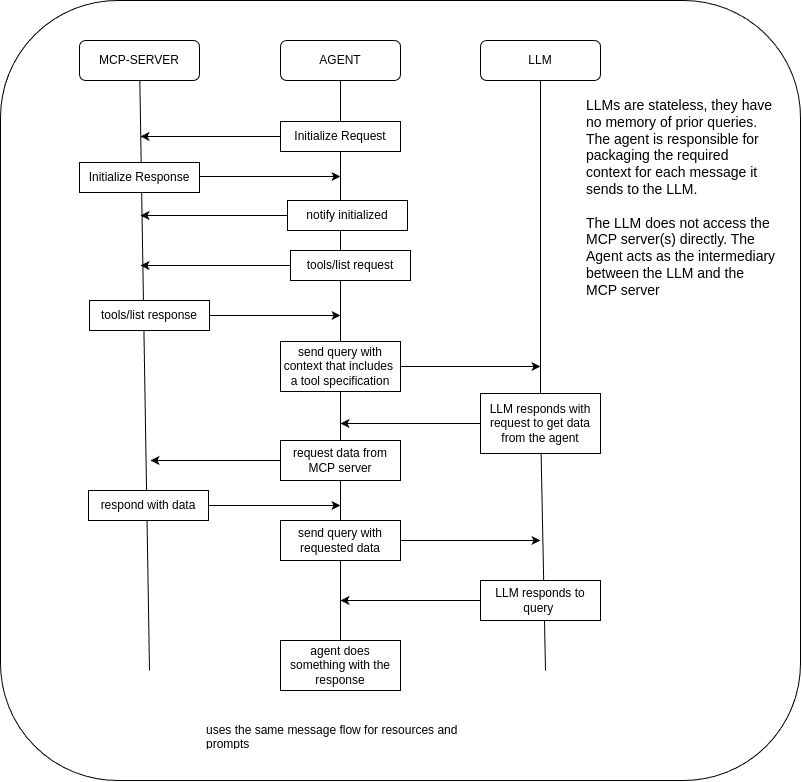

The Model Context Protocol (MCP) handles context and capabilities through a structured message flow where capabilities are dynamically injected into the LLM's context rather than pre-fetched by the agent. Here's how it works:

Key Message Flow Steps
Capability Discovery
When an MCP session starts:

The agent's MCP client queries connected servers to list available tools/resources ()

Servers respond with structured JSON descriptions of their capabilities (e.g., tool names, parameters, data schemas)

Context Augmentation
The agent packages both:
- User's query
- Server capability descriptions (tools/resources)
into the LLM's prompt context. For example:

```text
Available tools: 
- get_weather(location): Returns current weather data  
- search_docs(query): Searches company knowledge base  
User query: "What's the weather in Paris?"
```

LLM Decision Making
 - The LLM analyzes the query with awareness of available capabilities and either:
 - Answers directly using its knowledge
 - Or
 - Generates a structured request to use a specific tool/resource
    - The agent's MCP client executes the requested tool via the server
    - Raw results are returned to the client ()
    - These results are then injected into a new LLM query context for final response generation

Critical Architecture Pattern
Capabilities-as-Context

Aspect	Implementation	Source
Server capabilities	Included in initial prompt context	
Raw data	Retrieved after LLM tool selection	
This approach:

Keeps LLM context windows efficient by avoiding premature data fetching

Lets the LLM decide which capabilities are relevant to each query

Maintains security through scoped access controls ()

Example Workflow

```text
sequenceDiagram
    participant User
    participant Agent
    participant LLM
    participant MCPServer
    
    User->>Agent: "What's our Q2 sales forecast?"
    Agent->>MCPServer: Discover capabilities
    MCPServer-->>Agent: Lists "get_sales_data" tool
    Agent->>LLM: Send query + tool description
    LLM->>Agent: Request "get_sales_data(Q2)"
    Agent->>MCPServer: Execute tool
    MCPServer-->>Agent: Return spreadsheet data
    Agent->>LLM: Send data + original query
    LLM->>Agent: Formatted answer
    Agent->>User: "Q2 forecast: $4.2M (+12% YoY)"
```

This architecture balances flexibility with efficiency - servers advertise capabilities upfront, but actual data retrieval only happens when the LLM explicitly requests it.
